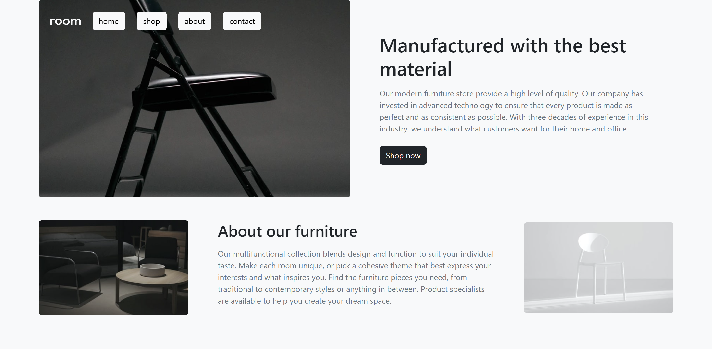

# Landing-Bootstrap

Una página sencilla realiza para fines prácticos con **Bootstrap**.

👉 Enlace: [https://landing-with-bootstrap.netlify.app/](https://landing-with-bootstrap.netlify.app/)

  
  
  
  
  
  

